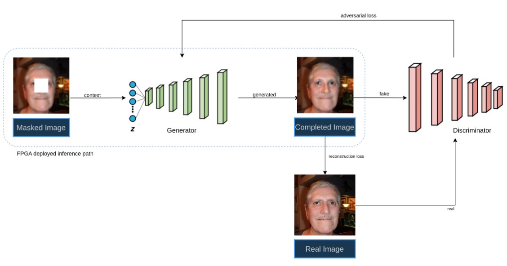
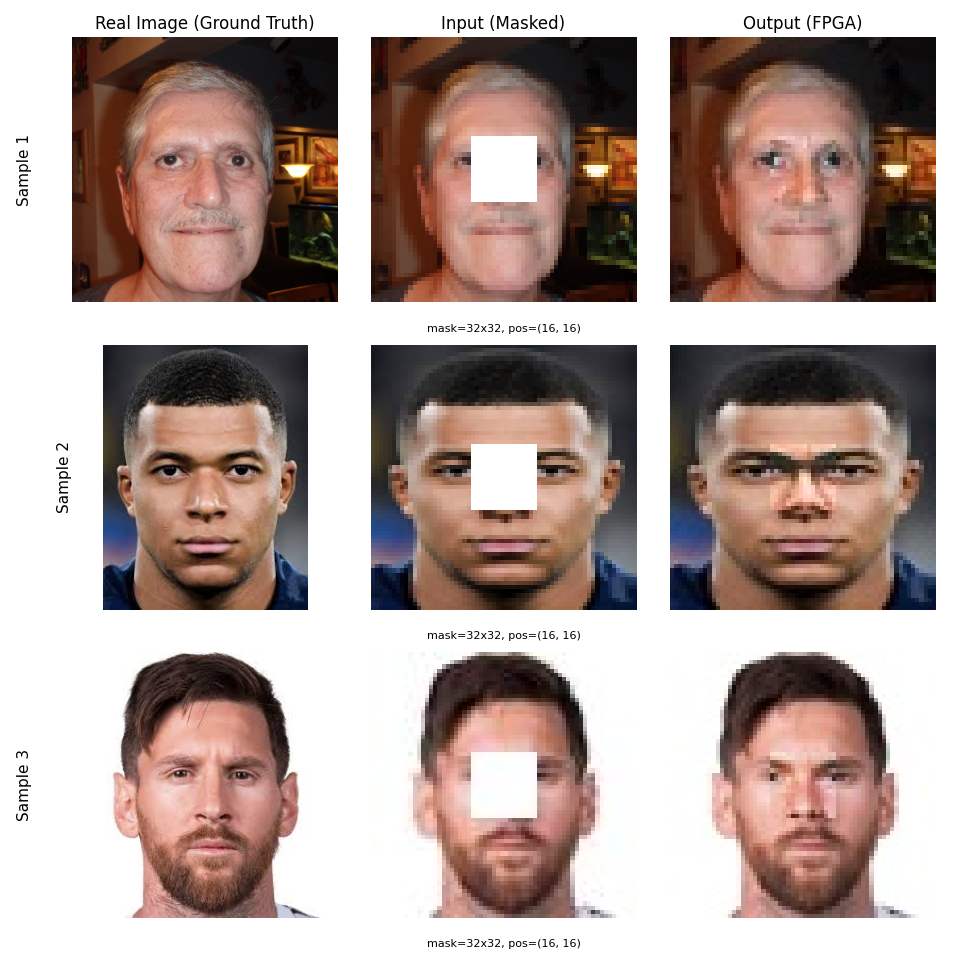

# Image Inpainting using Context Encoder GAN on FPGA
Full-stack hardware accelerator for Context Encoder GAN (Generative Adversarial Network). End-to-end implementation from PyTorch model training to custom Verilog RTL deployment (Conv, MAC, BatchNorm) on Xilinx Zynq/PYNQ FPGA.



The project covers the complete pipeline: from training the neural network model using PyTorch, converting the trained weights, designing the custom RTL accelerator in Verilog, all the way to deploying the bitstream on the FPGA using Python/PYNQ.

## 🌟 Key Features
- **End-to-End Pipeline**: Includes model training (Python/PyTorch), hardware design (Verilog), and software deployment (PYNQ).
- **Custom RTL Modules**: Built-from-scratch optimized Verilog modules for Convolution, MAC arrays, memory generation, and activation functions (BatchNorm, LeakyReLU, ReLU, Tanh).
- **Vivado Automation**: Tcl scripts for automated Vivado project generation, block design synthesis, and bitstream generation.
- **Cycle-Accurate Verification**: Comprehensive verification scripts to match RTL output bit-by-bit against the PyTorch reference model.

## 📂 Repository Structure

The project is organized into the following directories:

* 📁 **`Model_Training_and_Inference/`**
  * Contains the Python scripts for training the PyTorch model (`train.py`, `models.py`).
  * Scripts to run software inference and extract quantized weights (`extract_weights.py`) to `.hex` format for the RTL.
* 📁 **`Hardware_Design/`**
  * `rtl/`: Core Verilog source code for the GAN accelerator.
  * `tb/`: Testbenches for module-level and system-level verification.
  * `weights_hex/`: Pre-trained model weights ready for memory initialization.
  * `*.tcl` & `Makefile`: Scripts for Vivado automation and bitstream generation.
* 📁 **`Software_Deployment/`**
  * Contains the Jupyter Notebooks and Python wrappers (`USB_GAN`) to run the generated `.bit` and `.hwh` files directly on the PYNQ board.
* 📁 **`Verification_and_Scripts/`**
  * Python utilities to visualize RTL simulation outputs, plot pipeline performance, and compare hardware outputs against the software baseline.
* 📁 **`Documentation/` & `Results_and_Figures/`**
  * Project documentation, architecture diagrams, and generated output images from the FPGA.


## 🚀 Getting Started

### 1. Hardware Simulation & Build
To run the RTL simulation and build the bitstream:

```bash
cd Hardware_Design
make sim            # Run Verilog simulation
vivado -mode batch -source build_bitstream.tcl  # Generate Bitstream
```

### 2. Software Deployment (PYNQ)
#### 1. Transfer the Software_Deployment/USB_GAN folder to your PYNQ board.
#### 2. Ensure the generated .bit and .hwh files from Vivado are placed inside the deployment folder.
#### 3. Run the inference script:

```bash
python3 pynq_runner.py
```


## 🛠️ Technology Stack
* Hardware Definition: Verilog (RTL)
* Software/Model: Python, PyTorch
* EDA Tools: Xilinx Vivado 2023.2, Verilator, Icarus Verilog
* Target Platform: Xilinx Zynq / PYNQ FPGA
