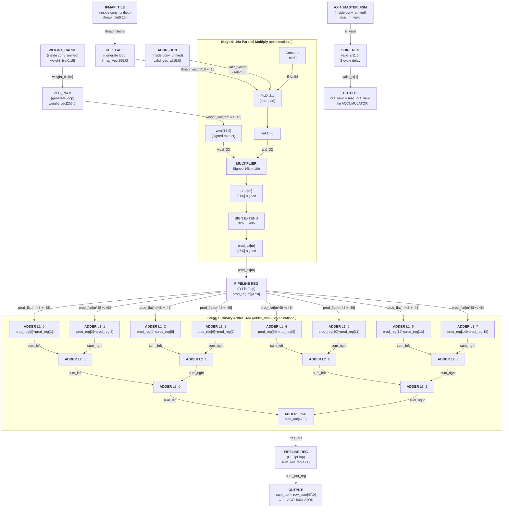
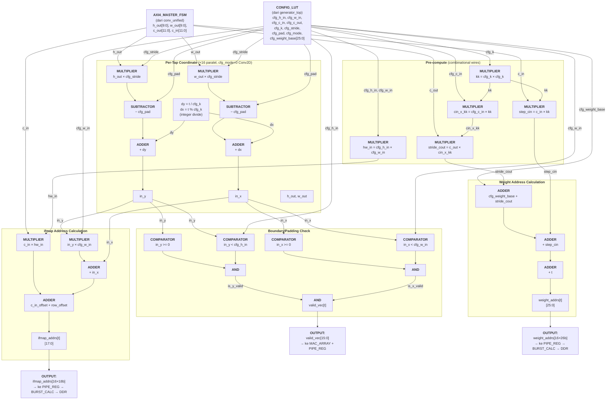
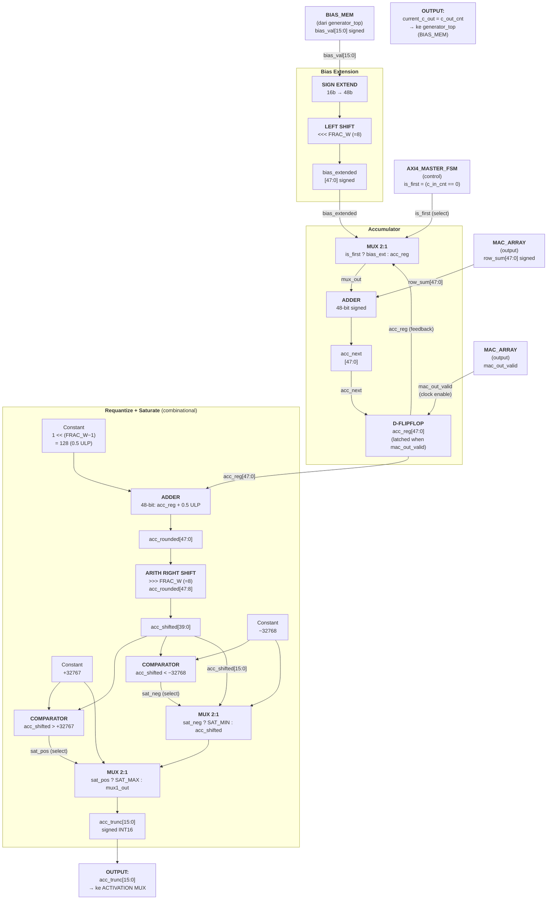
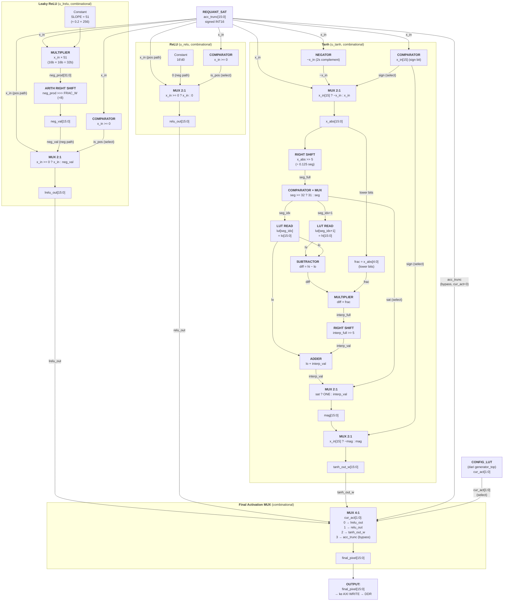

## Block Diagram 1: MAC Array (`mac_array.v`)

Catatan: Semua operasi paralel untuk 16 tap (m = 0..15).
Input dari luar conv_unified: `bias_val[15:0]` dari **generator_top (BIAS_MEM)**.
Input dari dalam conv_unified: `weight_vec`, `ifmap_vec` dari **VEC_PACK**; `valid_vec_w` dari **addr_gen**; `mac_in_valid` dari **AXI4_MASTER_FSM** (`state == ST_COMPUTE_ISSUE`).

## Block Diagram 2: Address Generator (`addr_gen.v`)

Catatan: Diagram ini menunjukkan datapath untuk SATU tap (t). Hardware ini di-generate 16x secara paralel.
Semua operasi bersifat **combinational** (tidak ada clock/register di dalam addr_gen).
Mode: `cfg_mode=0` → Conv2D; `cfg_mode=1` → ConvTranspose2D. Diagram ini menunjukkan path Conv2D.

## Block Diagram 3: Accumulator + Requantization (inside `conv_unified.v`)

Input dari luar conv_unified: `bias_val[15:0]` dari **generator_top (BIAS_MEM)**.
Input dari dalam conv_unified: `row_sum[47:0]` + `mac_out_valid` dari **MAC_ARRAY**; `is_first` dari **AXI4_MASTER_FSM** (`c_in_cnt == 0`).

## Block Diagram 4: Parallel Activation + Output MUX (inside `conv_unified.v`)

Input: `acc_trunc[15:0]` dari **REQUANT_SAT** (diagram 3).
Control: `cur_act[1:0]` dari **CONFIG_LUT** (di generator_top).
Output: `final_pixel[15:0]` → ke **AXI4 WRITE** → DDR.

